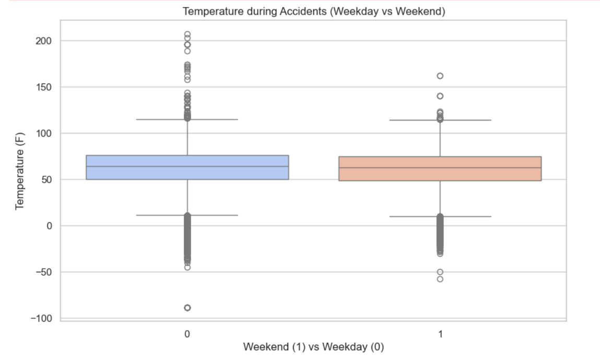

# MSDS-597 Project

Group: 17

## Project summary

Our project summary can be found:

- as a notebook on `nbviewer`

https://nbviewer.org/gist/GireesheePendela05/2ded31d49d9f2d018ca47b055ca543b0 

- as a website:

https://moran-teaching.github.io/project-group-17/

## Accessing data

Our raw data can be downloaded here:

https://www.kaggle.com/datasets/sobhanmoosavi/us-accidents

- **Dataset Title:** US Accidents (3.0 Million records)
- **Provided By:** Sobhan Moosavi (Kaggle user)
The primary dataset used for this project is the **US Accidents (3.0 million records)** dataset.  
It was sourced from **Kaggle**, a popular platform for sharing datasets and competitions in data science.

The dataset is compiled and provided by **Sobhan Moosavi**, who aggregated and shared the accident reports data.  
The original accident data is collected from various US traffic incident reporting services and public sources such as:

- US Department of Transportation
- Local transportation agencies
- Traffic APIs and sensors

Our processed data can be downloaded here: 

https://drive.google.com/file/d/1n1PY7TDNqYezVx1R4wanDH9AMJ6FLbNQ/view?usp=sharing

## Python scripts / notebooks

- ## Data Cleaning

- **Location in repo:** `notebooks/data_cleaning.ipynb`

1. **Data Retrieval:** Loading the raw dataset (`US_Accidents_March23.csv`) from Kaggle using pandas.

2. **Data Cleaning Steps:**

   2.1 **Time Conversion:** Conversion of `Start_Time` and `End_Time` columns to datetime objects.

   2.2 **Feature Engineering:** Extraction of the hour from `Start_Time` to create a new `Hour` feature.

   2.3 **Handling Missing Values:** Computation and inspection of missing data percentages across columns.

   2.4 **Data Enrichment:** Feature engineering steps **including** new columns based on existing ones.

   2.5 **Basic Data Cleaning:** Removal of irrelevant or redundant columns, and preparation of data types for analysis.

   2.6 **Final Adjustments:** Additional treatment of null values, and preparation of the cleaned dataframe for export or further analysis.
    
- ## Data Exploration

- **Location in repo:** `notebooks/data_exploration.ipynb`  
- **Description:** This notebook performs exploratory data analysis through visualizations to uncover patterns in accident data. It includes:

   3.1 **Accidents by Hour:** Visualization of accident distribution across hours using a bar plot.  

   3.2 **Top 10 States with Most Accidents:** A Pie chart showing which states have the highest accident counts.  

   3.3 **Top 10 Cities with Most Accidents:** Bar plot of cities with the most accident occurrences.  

   3.4 **Top 10 Weather Conditions:** Bar plot visualizing weather conditions most associated with accidents.
  
   3.5 **Temperature during accidents (Weekend vs Weekday):** Box plot comparing temperature distributions during accidents on weekdays (0) versus weekends (1).  

   3.6 **Accident Locations in USA** Geospatial plot displaying the geographic distribution of accidents across the continental United States based on latitude and longitude.  

   3.7 **Number of Accidents by hour** An interactive plot showing the number of accidents by hour.  

- ## Data Analysis

- ### (Part 1)
- **Location in repo:** `notebooks/data_analysis_Part1.ipynb`  
- **Description:** This notebook focuses on analyzing accident patterns in the dataset. It includes:

   4.1 **Most Dangerous Hours:** Identification of accident frequency by hour of the day.  

   4.2 **Most Accident-Prone States:** Ranking of U.S. states based on accident count using value counts.  

- ### (Part 2)
- **Location in repo:** `notebooks/data_analysis_Part2.ipynb`  
- **Description:** This notebook presents focused exploratory analysis to understand environmental factors related to accidents. It includes:

   4.3 **Weather Condition Analysis:** Frequency of accidents across different `Weather_Condition` categories.  

   4.4 **Temperature-Based Accident Distribution:** Categorization of accidents into cold (<32°F), moderate (32–80°F), and hot (>80°F) environments.  

   4.5 **Time-Based Visualization:** Interactive bar plot using Plotly to display accident frequency by hour of the day.  

- ## Regression Modeling

- **Location in repo:** `notebooks/regression_modeling.ipynb`  
- **Description:** This notebook focuses on modeling accident duration using statistical and machine learning techniques. It includes:

- **Data Preprocessing:** Conversion of time columns and computation of accident duration in minutes.  
- **Summary Statistics:** Descriptive analysis of key numeric variables such as `Duration`, `Temperature(F)`, `Hour`, `Start_Lat`, and `Start_Lng`, including missing value percentages.

   5.1 **Linear Regression:** Baseline model to predict accident duration from time and location-based features.  

   5.2 **Ridge Regression:** Regularized regression to reduce potential multicollinearity and improve stability.  

   5.3 **Test Set Evaluation:** Model validation using an 80/20 train-test split with performance metrics (MSE and R²) for both models.

## Reproducibility

Refer to `requirements.txt` file with packages and versions of all python packages to run the analysis.

## Guide

### Summary

1. ## Data Format

- **File Type:** CSV (Comma-Separated Values)
- **Size:** ~300 MB (after extraction)
- **Structure:** 
  - Each row represents one traffic accident/incident report.
  - Columns include fields like time of accident, location (city, state, latitude, longitude), weather conditions at the time of the accident, and environment features (e.g., presence of traffic signals).

  ## 1.1 Nature of the Data

- **Scope:** Covers accident data across 49 states in the United States (excluding Hawaii and Alaska).
- **Time Period:** Data collected from February 2016 to March 2023.
- **Data Fields Include:**
  - Accident timestamp and duration
  - Geographic location (city, county, state, coordinates)
  - Weather conditions at the time of accident (temperature, visibility, wind, precipitation)
  - Road features (presence of bumps, crossings, traffic signals, etc.)
- **Update Frequency:** 
  - The Kaggle dataset is static — it was last updated by the contributor in 2023.
  - It is **not automatically updated** with new accidents unless manually uploaded again by the contributor.

2.  Data Retrieval

## 2.1 Retrieval Method

The US Accidents dataset was **manually downloaded** from Kaggle.

The retrieval method involved:

1. Logging into a Kaggle account.
2. Navigating to the [US Accidents dataset page](https://www.kaggle.com/datasets/sobhanmoosavi/us-accidents).
3. Clicking "Download" to obtain the dataset ZIP archive.
4. Extracting the `US_Accidents_March23.csv` file from the archive.
5. Saving the CSV file locally in the `/data/` directory of the project repository (excluded from Git tracking).

## 2.2 Note on Automation

If the dataset had been publicly accessible without authentication, retrieval could have been automated using:

- Python `requests` library for direct file download.
- Kaggle's CLI tool (`kaggle datasets download`) if project permissions allowed.

However, due to manual login requirements on Kaggle, **the retrieval process was manual** for this project.

# 3. From Raw Data to Tidy Tabular Data

## 3.1 Initial Raw Data Format

The raw dataset was loaded from a CSV file into a pandas DataFrame.  
Each row represents a single accident report, with columns including time, location, weather conditions, and road attributes.

The initial dataset contained:
- Timestamp columns (`Start_Time`, `End_Time`) as string objects.
- Location coordinates (`Start_Lat`, `Start_Lng`) as numeric values.
- Some missing values in weather-related fields.
- Extra columns not directly relevant to the main analysis.

## 3.2 Data Cleaning and Transformation Steps

Several steps were performed to clean and prepare the dataset:

- **Datetime Conversion:**  
  Converted the `Start_Time` and `End_Time` columns from string to `datetime` format using `pandas.to_datetime()`.  
  This enabled accurate extraction of temporal features such as "hour of day".

- **Feature Extraction:**  
  Extracted the "Hour" from the `Start_Time` column and created a new `Hour` field for time-of-day analysis.

- **Missing Values Handling:**  
  Identified columns with missing values (e.g., `Temperature(F)`, `Weather_Condition`).  
  Depending on the field, either:
  - Left missing values as-is for optional filtering later, or
  - Dropped rows only if critical fields (like location or time) were missing.

- **Column Selection:**  
  Selected only a subset of useful columns relevant to the analysis:
  - `ID`, `Start_Time`, `End_Time`, `State`, `City`, `Start_Lat`, `Start_Lng`, `Temperature(F)`, `Weather_Condition`, `Hour`.

- **Data Type Checking:**  
  Verified that numeric, categorical, and datetime fields had the appropriate types for analysis.

## 3.3 Result

After these steps, the dataset became:

- Cleaned of obvious inconsistencies.
- Structured in a tidy tabular format.
- Ready for grouping, summarizing, and visualization.

Each row cleanly represents one accident event with consistent types across all fields.

# 4. Data enrichment steps: 
- Convert Timestamps: Convert Start_Time and End_Time to datetime format.    
- Duration Calculation: Create a Duration_minutes feature by calculating the time difference between End_Time and Start_Time.    
- Time Features Extraction: Extract Start_Hour, Start_DayOfWeek, and Start_Month from Start_Time.     
- Day/Night Classification: Classify accidents as Day (6 AM - 6 PM) or Night based on Start_Hour.     
- Weekend Flag: Assign a binary Is_Weekend flag (1 for Saturday/Sunday, 0 otherwise).     
- Season Mapping: Assign a Season based on Start_Month using a mapping function.    

# 5. Meaningful summary statistics:

- **5.1. Analysis 1: Hourly Distribution of Accidents**  
  - The distribution of accidents by hour reveals clear temporal patterns:  
    - Morning peaks at 7 AM and 8 AM (533,444 and 528,563 accidents respectively), followed by an evening peak between 4 PM and 6 PM.  
    - Lowest accident counts occur between 2 AM and 5 AM, when traffic volume is minimal.  
  - This suggests that accident frequency closely follows daily commuting behavior, highlighting rush hours as critical periods for road safety interventions.  

- **5.2. Analysis 2: State-wise Accident Count**  
  - Among all states, California (1.52M), Florida (751K), and Texas (535K) reported the highest accident counts.  
  - These figures align with population density and traffic volumes in major metropolitan areas. It highlights the need for localized traffic safety strategies and infrastructure planning.  

- **5.3. Analysis 3: Weather Conditions at Accident Time**  
  - The majority of accidents occurred during ‘Fair’ (2.19M) and ‘Mostly Cloudy’ (921K) weather conditions, rather than during severe weather.  
  - This implies that accidents are more frequent when road visibility is good, likely because people are more active and possibly more complacent. Hazardous conditions like snow or fog, while dangerous, see fewer total accidents — possibly due to reduced road usage or more cautious driving.  

- **5.4. Analysis 4: Temperature Analysis**  
  - Average temperature at accident time was 61.7°F.  
  - Most accidents occurred in moderate temperatures (32°F–80°F) with ~5.18 million records, compared to 1.14M in hot and 480K in cold weather.  
  - This distribution mirrors typical driving conditions across most of the US and reflects seasonal traffic volume. However, extreme temperatures could still influence accident severity rather than frequency.  

- **5.5. Analysis 5: Accident Duration Statistics**    
  - count:        6.805138e+06    
  - mean:         4.282940e+02    
  - std:      1.328626e+04    
  - min:      1.216667e+00    
  - 25%:      3.000000e+01    
  - 50%:      6.240000e+01    
  - 75%:      1.225000e+02    
  - max:     2.812939e+06  
  
     
# 6. Data visualizations & Trends:

 ## 6.1. Distribution of Accidents by Hour:
    
  - This histogram shows that accidents peak around 7 AM and again between 4–6 PM.
  - These peaks align with morning and evening rush hours, indicating commuter traffic is a major factor.

 ## 6.2. Top 10 States with Most Accidents
     
 - A pie chart showing that states like California, Florida, and Texas report the highest number of accidents.
 - Accident volume correlates with state population and urban density.

## 6.3. Top 10 Cities with Most Accidents

- A horizontal bar plot highlighting cities with the highest accident counts.
- Large metropolitan cities show significantly more accidents, likely due to higher traffic volumes.

## 6.4.Top 10 Weather Conditions during Accidents

- Bar chart showing most accidents happen in 'Fair', 'Clear', and 'Mostly Cloudy' weather.
- Contrary to intuition, severe weather conditions aren’t the most common during accidents, suggesting that normal driving conditions may lead to more complacency.

## 6.5. Temperature during Accidents (Weekday vs Weekend)

- Box plot comparing temperature distributions for accidents on weekdays vs weekends.
- Temperature ranges are similar across both, but there are slightly more extreme values during weekends.

## 6.6. Accident Locations in USA

- A scatter plot mapping accident coordinates across the U.S., forming clear outlines of the highway network.
- High accident densities follow major interstate routes and urban corridors, especially in the East, California, and Texas.

## 6.7. Interactive Plot: Number of Accidents by hour.

>Find the interactive plot in the website at the begining of the 'Readme.md' file

### Major trends observed:
- Rush hours are dangerous: Accident peaks align with typical commuting times (7–9 AM, 4–6 PM).
- Population density matters: States and cities with larger populations see more accidents.
- Normal weather does not mean safe driving: Most accidents occur in fair or clear conditions, suggesting driver behavior is more crucial than weather.
- Accidents cluster around road networks: Geographic distribution matches interstate and urban traffic corridors.

# 7. Regression Modeling: Predicting Accident Frequency

### 7.1 Objective
Predict accident frequency using features such as **weather conditions**, **temperature**, **state**, and **city**.

### 7.2 Models Used
- **Linear Regression**: Used as a baseline model to understand relationships between features and accident frequency.
- **Ridge Regression**: Added regularization to reduce overfitting and test for performance improvement.

### 7.3 Model Performance

#### 7.3.1 Linear Regression
- **Mean Squared Error (MSE):** 17,968,374,622.93  
- **R² Score:** 0.02 → Indicates **very weak predictive power**

#### 7.3.2 Ridge Regression
- **Mean Squared Error (MSE):** 17,968,374,622.94  
- **R² Score:** 0.02 → **No improvement** over Linear Regression

> Both models showed **poor performance**, with high error and negligible explained variance.

### Feature Coefficients (Influence on Accident Frequency)

| Feature            | Coefficient | Interpretation                                                                 |
|--------------------|-------------|---------------------------------------------------------------------------------|
| **Weather_Condition**  | +230.45     | Higher weather index (e.g., rain, snow) increases accident frequency            |
| **Temperature (°F)**   | +777.99     | Accident frequency increases with temperature                                  |
| **State**              | +439.48     | Location factor based on state encoding                                        |
| **City**               | −0.0574     | Slight inverse correlation with accident frequency                             |

> Coefficients were identical for both models, indicating **regularization had minimal impact**.

### Key Insights

- **Weak Model Fit:** Both models poorly predicted accident frequency due to **low R²** and **high MSE**.
- **Linear ≈ Ridge:** Ridge regularization **did not help**, suggesting overfitting was not the main issue.
- **Feature Relevance:** The selected features **may not strongly influence accident frequency**.
- **Recommendation:** Enhance the model with **more meaningful features** (e.g., traffic volume, time of day, road type), and explore **non-linear models** (e.g., Random Forest, XGBoost).

 ----THANK YOU----
